Play the game: https://addy-washere.itch.io/between-the-lines

# Between the Lines

Between the lines is a video game I built as a personal project. It's a 3D, narrative first-person game built using Unity URP. You play as an author whose fictional main character unexpectedly came to life. Through exploring the world, your dialogue choices shape your character's personality. 

All the assets were modeled by myself in Blender.

## Controls 
| Key | Action |
|:---:|---|
| `W` `A` `S` `D` | Move |
| `Mouse` | Look around |
| `Space` | Jump |
| `E` | Interact |
| `←` `→` | Select dialogue option |

## Screenshots

### Scenes
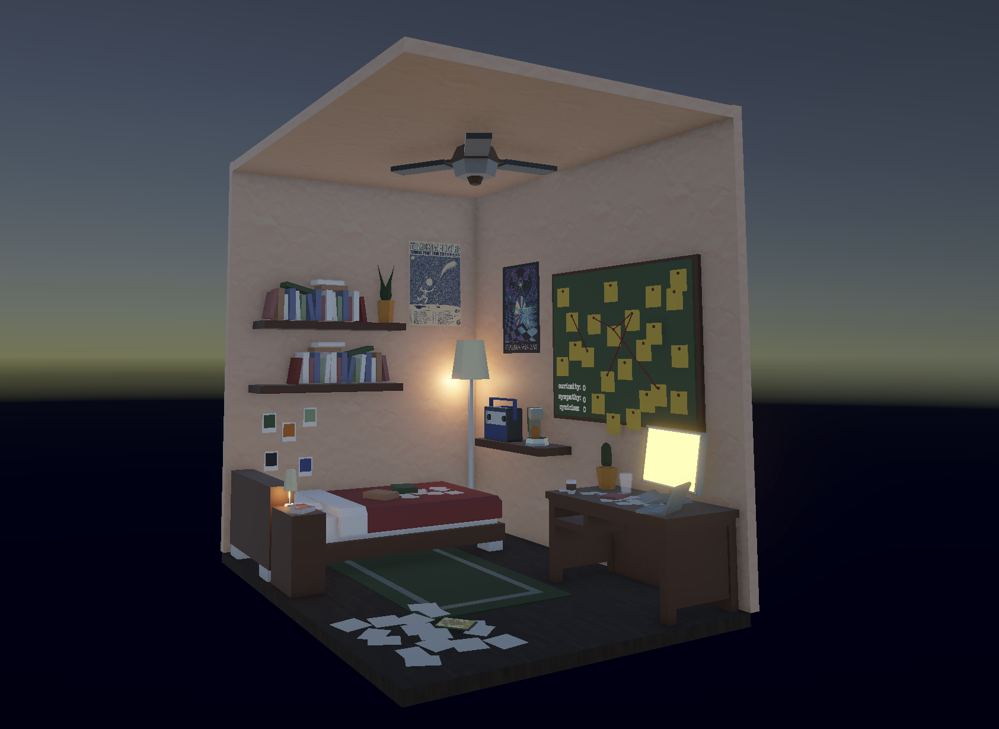
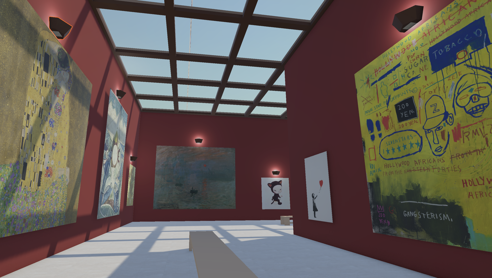
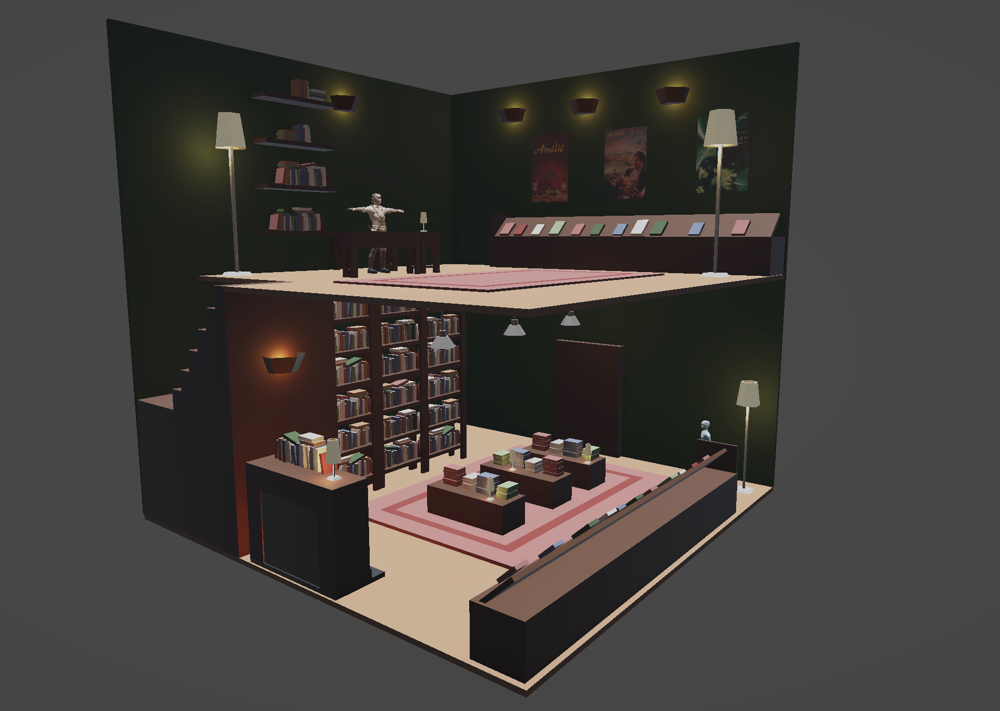
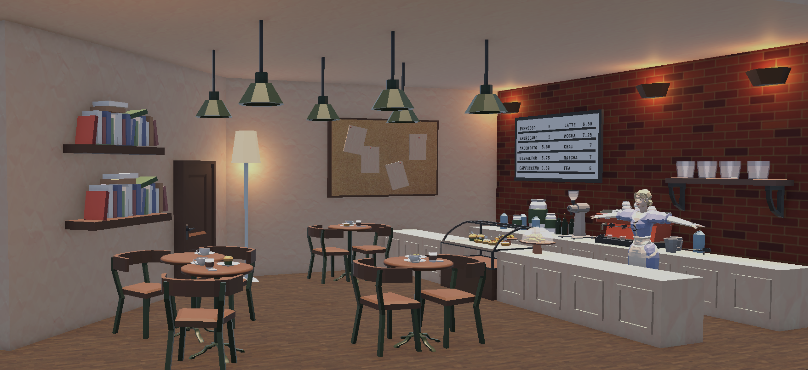
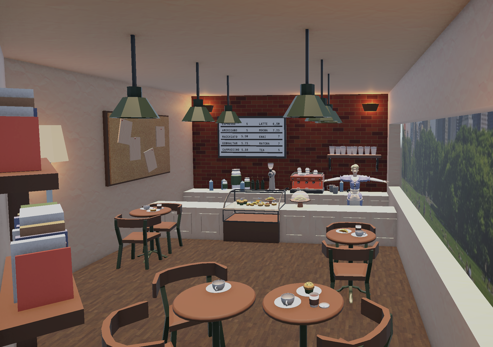
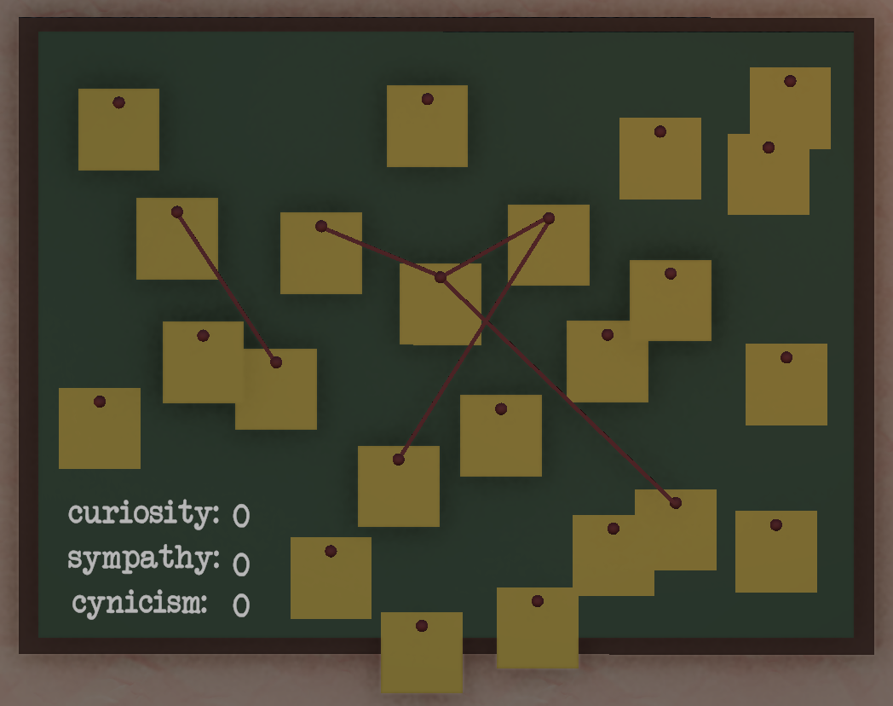

### Blender
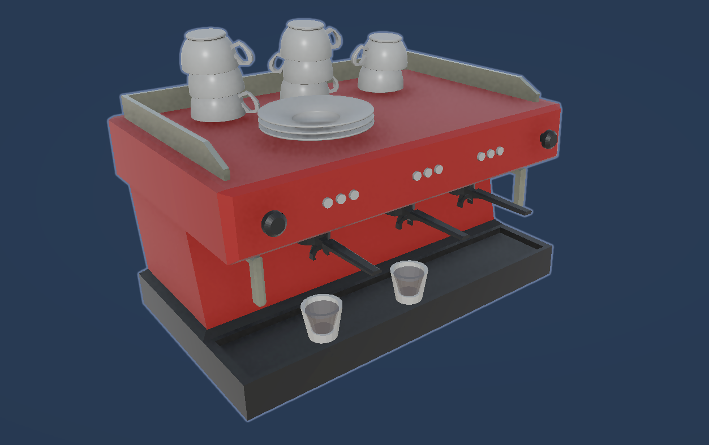
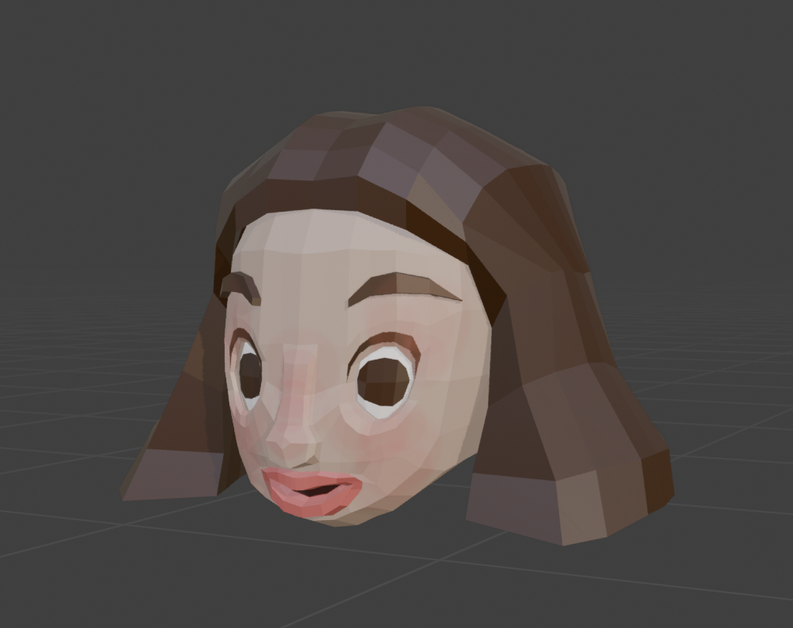
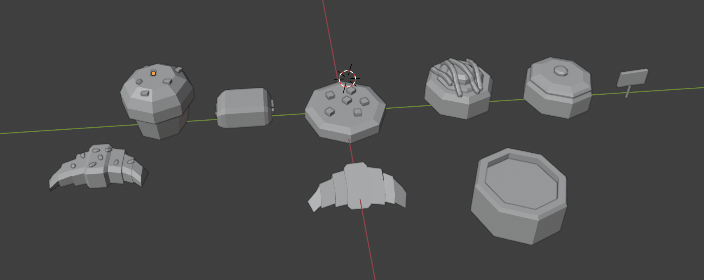
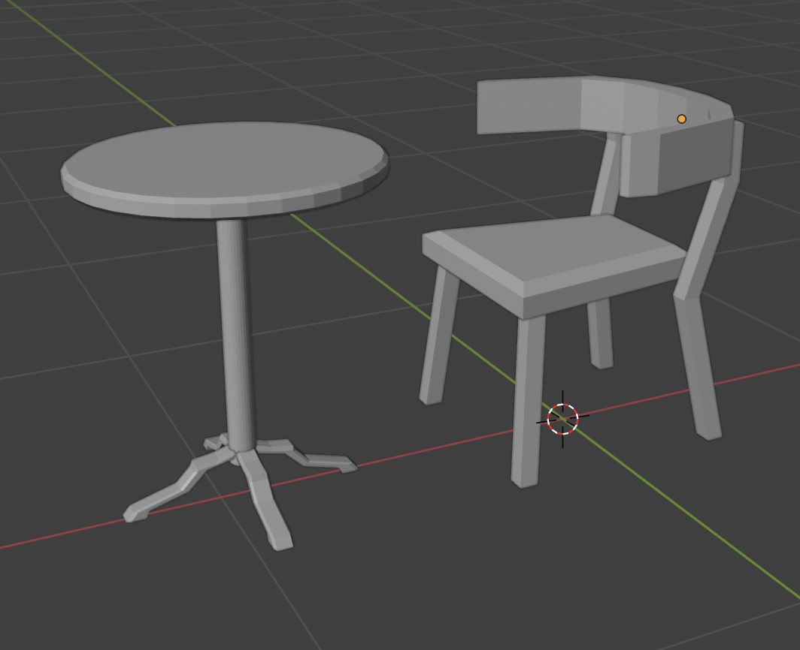
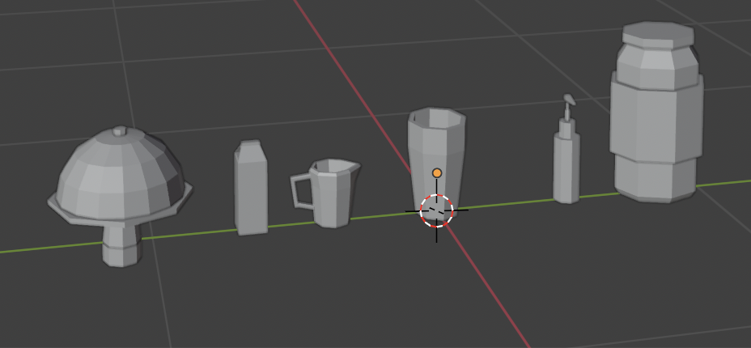
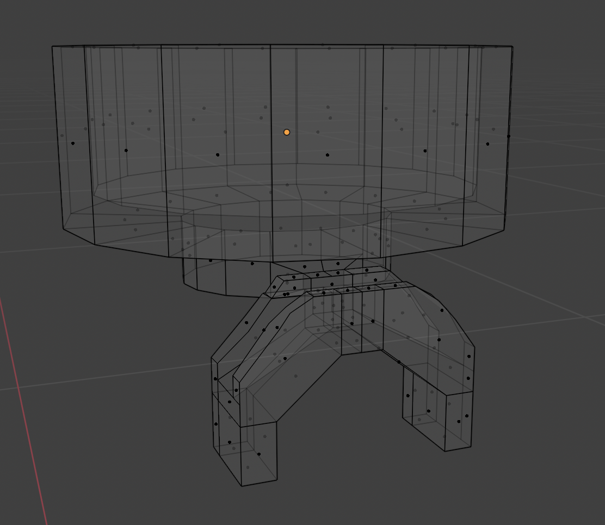

### Dialogue
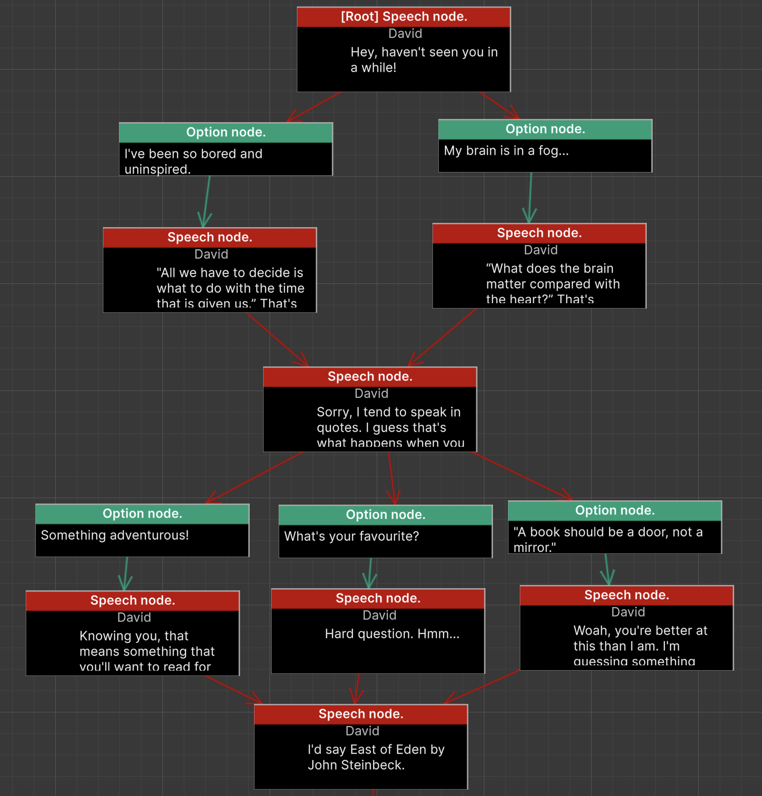

